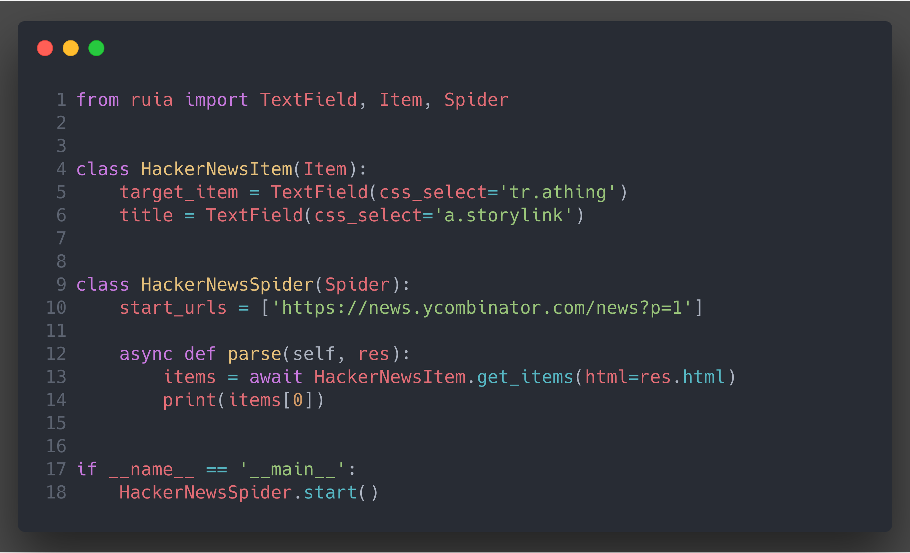

# Ruia

[](https://travis-ci.org/howie6879/ruia) 
[](https://pypi.org/project/ruia/) 
[](https://pypi.org/project/ruia/) 
[](https://github.com/howie6879/ruia)



## Overview

An async web scraping micro-framework, written with `asyncio` and `aiohttp`, 
aims to make crawling url as convenient as possible.

Write less, run faster:

- Documentation: [中文文档][doc_cn] |[documentation][doc_en]
- Plugins: [https://github.com/ruia-plugins][plugins]

## Features

- **Easy**: Declarative programming
- **Fast**: Powered by asyncio
- **Extensible**: Middlewares and plugins
- **Powerful**: JavaScript support

## Installation

``` shell
# For Linux & Mac
pip install -U ruia[uvloop]

# For Windows
pip install -U ruia

# New features
pip install git+https://github.com/howie6879/ruia
```

## Usage

### JavaScript Support

You can load js by using [ruia-pyppeteer](https://github.com/ruia-plugins/ruia-pyppeteer).

For example:

```python
import asyncio

from ruia_pyppeteer import PyppeteerRequest as Request

request = Request("https://www.jianshu.com/", load_js=True)
response = asyncio.run(request.fetch()) # Python 3.7
print(response.html)
```

### Item

`Item` can be used standalone, for testing, and for tiny crawlers.

```python
import asyncio

from ruia import AttrField, TextField, Item


class HackerNewsItem(Item):
    target_item = TextField(css_select='tr.athing')
    title = TextField(css_select='a.storylink')
    url = AttrField(css_select='a.storylink', attr='href')

items = asyncio.run(HackerNewsItem.get_items(url="https://news.ycombinator.com/"))
for item in items:
    print(item.title, item.url)
```

Run: `python demo.py`

```shell
Notorious ‘Hijack Factory’ Shunned from Web https://krebsonsecurity.com/2018/07/notorious-hijack-factory-shunned-from-web/
 ......
```

### Spider

`Spider` is used for control requests better.
`Spider` supports concurrency control, which is very important for spiders.

```python
import aiofiles
from ruia import AttrField, TextField, Item, Spider


class HackerNewsItem(Item):
    target_item = TextField(css_select='tr.athing')
    title = TextField(css_select='a.storylink')
    url = AttrField(css_select='a.storylink', attr='href')

    async def clean_title(self, value):
        """Define clean_* functions for data cleaning"""
        return value


class HackerNewsSpider(Spider):
    start_urls = [f'https://news.ycombinator.com/news?p={index}' for index in range(1, 10)]

    async def parse(self, response):
        items = await HackerNewsItem.get_items(html=response.html)
        for item in items:
            async with aiofiles.open('./hacker_news.txt', mode='a', encoding='utf-8') as f:
                await f.write(item.title + '\n')


if __name__ == '__main__':
    HackerNewsSpider.start()
```

Run `hacker_news_spider.py`:

``` shell
[2018-09-21 17:27:14,497]-ruia-INFO  spider::l54: Spider started!
[2018-09-21 17:27:14,502]-Request-INFO  request::l77: <GET: https://news.ycombinator.com/news?p=2>
[2018-09-21 17:27:14,527]-Request-INFO  request::l77: <GET: https://news.ycombinator.com/news?p=1>
[2018-09-21 17:27:16,388]-ruia-INFO  spider::l122: Stopping spider: ruia
[2018-09-21 17:27:16,389]-ruia-INFO  spider::l68: Total requests: 2
[2018-09-21 17:27:16,389]-ruia-INFO  spider::l71: Time usage: 0:00:01.891688
[2018-09-21 17:27:16,389]-ruia-INFO  spider::l72: Spider finished!
```

### Custom middleware

`ruia` provides an easy way to customize requests.

The following middleware is based on the above example:

```python
from ruia import Middleware

middleware = Middleware()


@middleware.request
async def print_on_request(request):
    request.metadata = {
        'index': request.url.split('=')[-1]
    }
    print(f"request: {request.metadata}")
    # Just operate request object, and do not return anything.


@middleware.response
async def print_on_response(request, response):
    print(f"response: {response.metadata}")

# Add HackerNewsSpider

if __name__ == '__main__':
    HackerNewsSpider.start(middleware=middleware)
```

## Read More

Visit [Ruia Documentation][doc_en] for more information.

## TODO

- [ ] Cache for debug, to decreasing request limitation
- [ ] Distributed crawling/scraping

## Contribution

Ruia is still under developing, feel free to open issues and pull requests:

- Report or fix bugs
- Require or publish plugins
- Write or fix documentation
- Add test cases

## Thanks

- [sanic](https://github.com/huge-success/sanic)
- [demiurge](https://github.com/matiasb/demiurge)

[doc_cn]: https://github.com/howie6879/ruia/blob/master/docs/cn/README.md
[doc_en]: https://howie6879.github.io/ruia/
[plugins]: http://howie6879.github.io/ruia/en/plugins/
