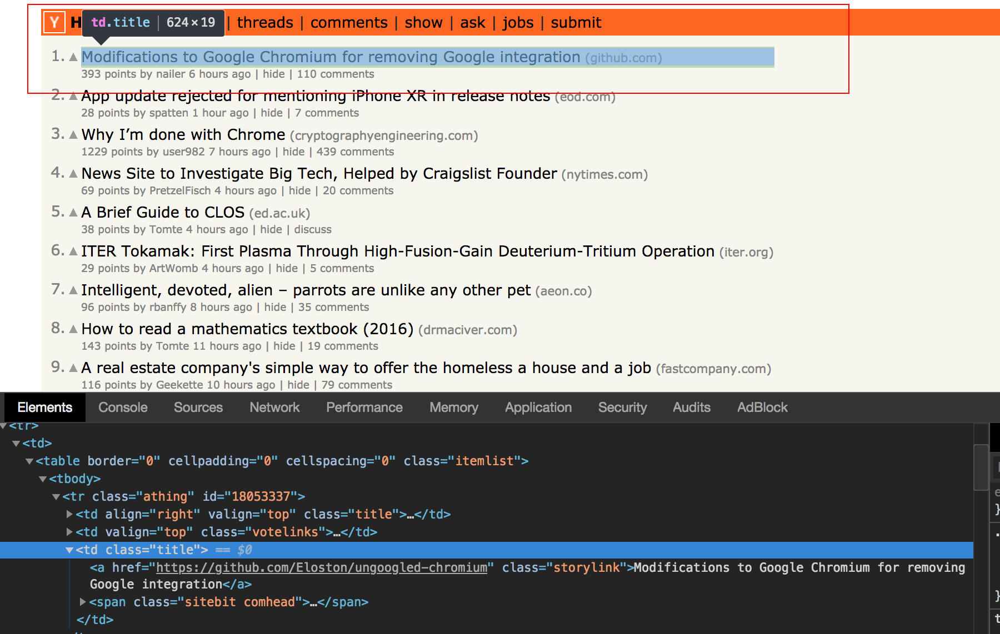
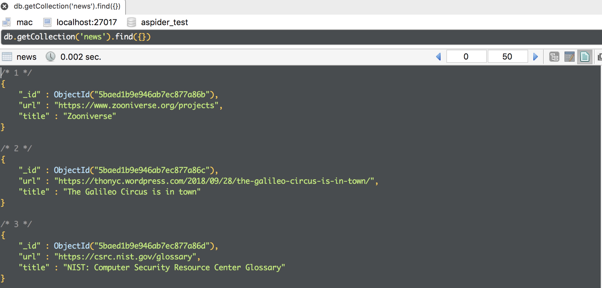

# Tutorials

目标：通过对[Hacker News](https://news.ycombinator.com/news)的爬取来展示如何使用**ruia**，下图红框中的数据就是我们需要爬取的：


假设我们将此项目命名为`hacker_news_spider`，项目结构如下：

```shell
hacker_news_spider
├── db.py
├── hacker_news.py
├── items.py
└── middlewares.py
```

## Item

`Item`的目的是定义目标网站中你需要爬取的数据，此时，爬虫的目标数据就是页面中的`Title`和`Url`，怎么提取数据，**ruia**提供了[CSS Selector](https://www.w3schools.com/cssref/css_selectors.asp)和[XPath](https://www.w3schools.com/xml/xpath_intro.asp)两种方式提取目标数据

``` text
Notice: 后续爬虫例子都默认使用CSS Selector的规则来提取目标数据
```

这里我们使用`CSS Selector`来提取目标数据，用浏览器打开[Hacker News](https://news.ycombinator.com/news)，右键审查元素：



显而易见，每页包含`30`条资讯，那么目标数据的规则可以总结为：

| Param       | Rule              | Description              |
| :---------- | ----------------- | ------------------------ |
| target_item | tr.athing         | 表示每条资讯             |
| title       | a.storylink       | 表示每条资讯里的标题     |
| url         | a.storylink->href | 表示每条资讯里标题的链接 |

规则明确之后，就可以用`Item`来实现一个针对于目标数据的ORM，创建文件`items.py`，复制下面代码：

```python
from ruia import AttrField, TextField, Item


class HackerNewsItem(Item):
    target_item = TextField(css_select='tr.athing')
    title = TextField(css_select='a.storylink')
    url = AttrField(css_select='a.storylink', attr='href')
```

只需要继承`Item`类，将目标参数定义为一个属性即可，如果目标数据是可以循环提取的，比如此时每一页里面有`30`条数据，那么就需要定义`target_item`来循环提取每一条数据里面的`Title`和`Url`

## Middleware

`Middleware`的目的是对每次请求前后进行一番处理，分下面两种情况：

- 在每次请求之前做一些事
- 在每次请求后做一些事

比如此时爬取[Hacker News](https://news.ycombinator.com/news)，你希望在每次请求时候自动添加`Headers`的`User-Agent`，可以将下面代码复制到你建立的`middlewares.py`文件中：

```python
from ruia import Middleware

middleware = Middleware()


@middleware.request
async def print_on_request(request):
    ua = 'ruia user-agent'
    request.headers.update({'User-Agent': ua})
```

这样，程序会在爬虫请求网页资源之前自动加上`User-Agent`

## Database

对于数据持久化，你可以按照自己喜欢的方式去做，接下来我们将以`MongoDB`为例对爬取的数据进行存储，创建`db.py`文件：

```python
import asyncio

from motor.motor_asyncio import AsyncIOMotorClient


class MotorBase:
    """
    About motor's doc: https://github.com/mongodb/motor
    """
    _db = {}
    _collection = {}

    def __init__(self, loop=None):
        self.motor_uri = ''
        self.loop = loop or asyncio.get_event_loop()

    def client(self, db):
        # motor
        self.motor_uri = f"mongodb://localhost:27017/{db}"
        return AsyncIOMotorClient(self.motor_uri, io_loop=self.loop)

    def get_db(self, db='test'):
        """
        Get a db instance
        :param db: database name
        :return: the motor db instance
        """
        if db not in self._db:
            self._db[db] = self.client(db)[db]

        return self._db[db]
```

## Spider

`Spider`可以说是爬虫程序的入口，它将`Item`、`Middleware`、`Request`、等模块组合在一起，从而为你构造一个稳健的爬虫程序

这次的目的仅仅是为了演示如何使用**ruia**编写爬虫，所以这个例子仅仅爬取[Hacker News](https://news.ycombinator.com/news)的前两页数据，创建`hacker_news.py`文件：

```python
from ruia import Request, Spider

from items import HackerNewsItem
from middlewares import middleware
from db import MotorBase


class HackerNewsSpider(Spider):
    start_urls = ['https://news.ycombinator.com']
    concurrency = 3

    async def parse(self, response):
        self.mongo_db = MotorBase().get_db('ruia_test')
        urls = ['https://news.ycombinator.com/news?p=1', 'https://news.ycombinator.com/news?p=2']
        for index, url in enumerate(urls):
            yield Request(
                url,
                callback=self.parse_item,
                metadata={'index': index}
            )

    async def parse_item(self, response):
        async for item in HackerNewsItem.get_items(html=response.html):
            yield item

    async def process_item(self, item):
        try:
            await self.mongo_db.news.update_one({
                'url': item.url},
                {'$set': {'url': item.url, 'title': item.title}},
                upsert=True)
        except Exception as e:
            self.logger.exception(e)


if __name__ == '__main__':
    HackerNewsSpider.start(middleware=middleware)
```

`HackerNewsSpider`继承于`Spider`类，其中子类必须实现`parse()`方法，运行`python hacker_news.py`：

```text
[2018-09-24 17:59:19,865]-ruia-INFO  spider : Spider started!
[2018-09-24 17:59:19,866]-Request-INFO  request: <GET: https://news.ycombinator.com>
[2018-09-24 17:59:23,259]-Request-INFO  request: <GET: https://news.ycombinator.com/news?p=1>
[2018-09-24 17:59:23,260]-Request-INFO  request: <GET: https://news.ycombinator.com/news?p=2>
[2018-09-24 18:03:05,562]-ruia-INFO  spider : Stopping spider: ruia
[2018-09-24 18:03:05,562]-ruia-INFO  spider : Total requests: 3
[2018-09-24 18:03:05,562]-ruia-INFO  spider : Time usage: 0:00:02.802862
[2018-09-24 18:03:05,562]-ruia-INFO  spider : Spider finished!
```

数据库中可以看到：



通过这个例子，你已经基本掌握了**ruia**的`Item`、`Middleware`、`Request`等模块的用法，结合自身需求，你可以编写任何爬虫，例子代码见[hacker_news_spider](https://github.com/howie6879/ruia/tree/master/examples/hacker_news_spider)

接下来，我们将结合实例，编写一个**ruia**的第三方扩展，详见：[Plugins](./plugins.md)